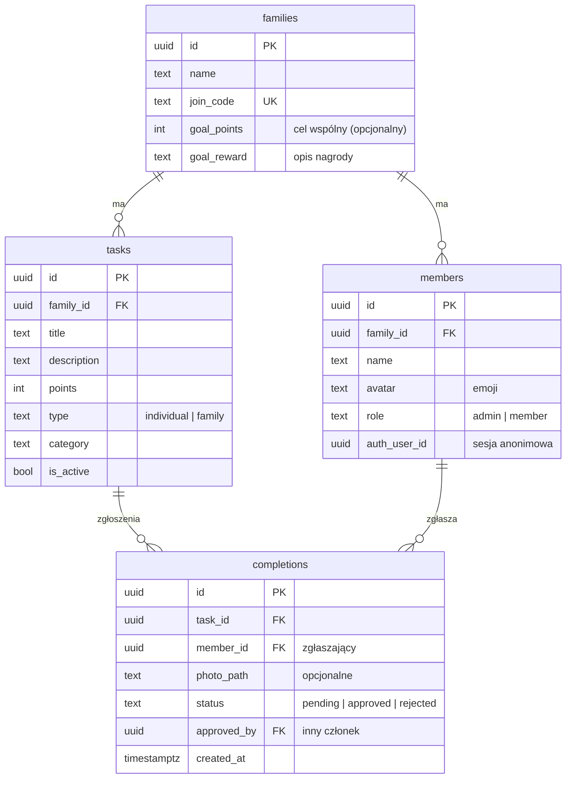
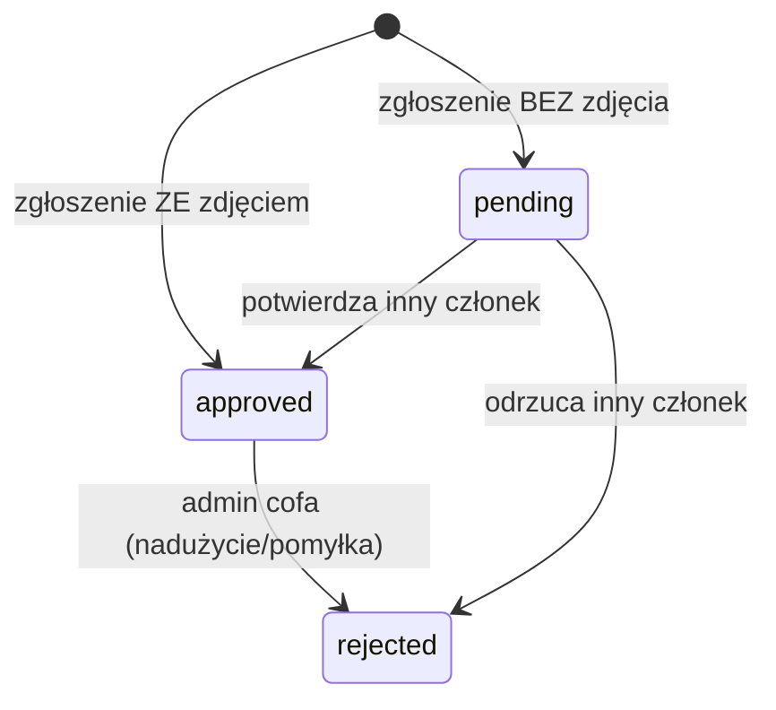

# Misja Portugalia — plan aplikacji

Rodzinna gra wakacyjna: wspólna lista zadań (misji) na wyjazd, punkty za ich wykonanie,
potwierdzanie zdjęciem lub przez innego członka wyprawy, ranking i wspólny cel rodziny.

**Priorytet: prostota i szybkość powstania.** MVP = aplikacja webowa (PWA, mobile-first),
z jasną ścieżką do wersji natywnych później.

---

## 1. Wizja w jednym akapicie

Przed wyjazdem rodzic (admin) tworzy „wyprawę", wpisuje listę zadań i rozsyła rodzinie
kod dołączenia. Na miejscu każdy na swoim telefonie widzi listę misji — część robi się
samemu (np. „powiedz *obrigado* w sklepie"), część całą rodziną (np. „wspólny zamek
z piasku"). Wykonanie zgłasza się zdjęciem (dowód = zaliczone) albo prosi się innego
członka wyprawy o potwierdzenie. Punkty wpadają do rankingu indywidualnego i do wspólnego
celu wyprawy (np. 500 pkt = wieczór z lodami na plaży). Po wyjeździe zostaje album zdjęć
z wykonanych misji.

## 2. Doprecyzowane założenia (przyjęte decyzje)

To, co w briefie było otwarte, doprecyzowałem poniżej. Każdy punkt to **domyślna decyzja** —
łatwa do zmiany przed startem implementacji (lista pytań otwartych na końcu dokumentu).

| # | Kwestia | Przyjęta decyzja |
|---|---------|------------------|
| Z1 | Uczestnicy | Jedna wyprawa, 2–8 osób. Każdy uczestnik ma dostęp do telefonu (własnego lub rodzica). Jeden rodzic jest adminem. |
| Z2 | Logowanie | **Bez kont i haseł.** Dołączenie przez kod wyprawy (lub link), potem wybór swojego profilu (imię + awatar-emoji). Dzieci nie potrzebują e-maila. Technicznie: sesja anonimowa przypięta do urządzenia. |
| Z3 | Rodzaje zadań | `indywidualne` — każdy członek może zaliczyć je **raz** (niezależnie od innych); `rodzinne` — wykonywane wspólnie, zaliczane **raz na wyprawę**, punkty dostaje **każdy** członek rodziny. |
| Z4 | Punktacja | Stała liczba punktów za zadanie, ustalana przez admina przy tworzeniu (sugerowane widełki 10–100). Ranking indywidualny + suma rodzinna liczona do wspólnego celu. |
| Z5 | Weryfikacja | Dwie równorzędne ścieżki (zgodnie z briefem „zdjęcie **lub** potwierdzenie"): **(a)** zgłoszenie ze zdjęciem → zaliczone od razu, zdjęcie widzą wszyscy (kontrola społeczna); **(b)** zgłoszenie bez zdjęcia → status „do potwierdzenia", zalicza je **jeden inny** członek wyprawy. Nie można potwierdzić samemu sobie. Admin może cofnąć każde zaliczenie (bezpiecznik na nadużycia). |
| Z6 | Nagrody | Poza aplikacją (decyzja rodziców). W aplikacji tylko **wspólny cel wyprawy**: próg punktowy + opis nagrody, z paskiem postępu. |
| Z7 | Zadania w trakcie | Startowa lista wpisana przed wyjazdem + admin może dodawać/edytować/dezaktywować zadania w trakcie wyprawy. |
| Z8 | Offline | MVP wymaga internetu (roaming UE działa w Portugalii). Zdjęcia są kompresowane po stronie telefonu przed wysyłką (oszczędność transferu). Pełny tryb offline — poza MVP. |
| Z9 | Język | Polski, jeden język w MVP. |
| Z10 | Prywatność | Zdjęcia (w tym dzieci) widoczne **wyłącznie** dla członków wyprawy: prywatny bucket, dostęp przez krótkotrwałe podpisane URL-e, izolacja danych na poziomie bazy (RLS). Możliwość usunięcia całej wyprawy z danymi. |

## 3. Zakres MVP

### Wchodzi (must have)

1. **Utworzenie wyprawy** (admin): nazwa, kod dołączenia, opcjonalny cel wspólny (próg + nagroda).
2. **Dołączenie**: link/kod → utworzenie profilu (imię, awatar-emoji) → od razu w grze.
3. **Zarządzanie zadaniami** (admin): dodaj/edytuj/dezaktywuj; pola: tytuł, opis, punkty, typ (indywidualne/rodzinne), kategoria (np. jedzenie, język, przygoda). Startowy zestaw przykładowych zadań do jednego kliknięcia (sekcja 9).
4. **Lista zadań** dla uczestnika: podział na indywidualne/rodzinne, status (do zrobienia / oczekuje / zaliczone), punkty.
5. **Zgłoszenie wykonania**: przycisk „Wykonane!" → opcjonalne zdjęcie prosto z aparatu → ścieżka (a) lub (b) z założenia Z5. Przy zadaniu rodzinnym zgłasza jedna osoba w imieniu rodziny.
6. **Potwierdzenia**: widok „Do potwierdzenia" z akcjami zatwierdź/odrzuć (z podglądem zdjęcia, jeśli jest).
7. **Wyniki**: ranking uczestników, pasek postępu celu wspólnego, feed ostatnich dokonań ze zdjęciami (auto-odświeżany).
8. **PWA**: instalacja na ekranie głównym telefonu, pełnoekranowy tryb mobilny.

### Nie wchodzi do MVP (roadmapa — sekcja 10)

Odznaki, zadania dnia, zadania powtarzalne, mapa, powiadomienia push, tryb offline,
eksport albumu, wiele wypraw na konto, wersje w sklepach (iOS/Android), tryb „rygorystyczny"
(zdjęcie też wymaga potwierdzenia).

## 4. Technologie

### Rekomendowany stack

| Warstwa | Wybór | Uzasadnienie |
|---------|-------|--------------|
| Frontend | **React + Vite + TypeScript**, jako **PWA** | Najszybsza droga do prostej aplikacji webowej; PWA daje „prawie natywne" wrażenie na telefonach (instalacja, pełny ekran, aparat przez `<input capture>`); ogromny ekosystem. |
| UI | **Tailwind CSS** (+ gotowe komponenty shadcn/ui w razie potrzeby) | Szybkie stylowanie mobile-first bez pisania CSS; spójny wygląd małym kosztem. |
| Dane po stronie klienta | **TanStack Query** + `supabase-js` | Cache, ponawianie zapytań na słabym zasięgu, subskrypcje realtime — bez własnego store'a. |
| Backend | **Supabase** (Postgres + Auth + Storage + Realtime) | Zero własnego serwera: baza, sesje anonimowe (Z2), przechowywanie zdjęć i live-odświeżanie rankingu w jednej usłudze; izolacja rodziny przez Row Level Security; darmowy plan w zupełności wystarczy. |
| Zdjęcia | `browser-image-compression` przed uploadem | Zdjęcia z telefonów mają 3–8 MB; kompresja do ~200–400 KB oszczędza roaming i miejsce. |
| Hosting | **Vercel** (albo Netlify) | Deploy z GitHuba na każdy push, HTTPS i domena od ręki, darmowy plan. |

**Koszt MVP: 0 zł** (darmowe plany Supabase i Vercel z dużym zapasem dla jednej rodziny).

### Ścieżka do wersji multiplatformowej (po MVP)

1. **Krok 1 — PWA (już w MVP):** każdy instaluje aplikację z przeglądarki na ekran główny; dla użytku rodzinnego to zwykle wystarcza.
2. **Krok 2 — Capacitor:** ten sam kod webowy opakowany w natywną powłokę → aplikacje iOS/Android do sklepów, dostęp do natywnego aparatu i powiadomień push. Brak przepisywania frontendu.
3. **Krok 3 (tylko gdyby zaszła realna potrzeba) — React Native/Expo:** backend (Supabase) i logika domenowa w TS zostają bez zmian, wymiana samej warstwy widoków.

### Rozważone alternatywy (odrzucone dla MVP)

- **Firebase zamiast Supabase** — równie dobry; wybrałem Supabase za relacyjny model (zadania↔zaliczenia↔punkty to naturalny SQL), RLS i brak vendor lock-inu. Zmiana na Firebase nie zmienia reszty planu.
- **Expo + React Native Web od razu** — jedna baza kodu na web i native brzmi kusząco, ale podnosi złożoność MVP i pogarsza web UX; kłóci się z priorytetem „prosto i szybko".
- **Next.js** — SSR/SEO tu niepotrzebne (aplikacja prywatna, za kodem), czysty Vite jest lżejszy.

## 5. Model danych

Zasady spójności (wymuszane w bazie):

- zadanie **indywidualne**: max jedno aktywne (pending/approved) zaliczenie na parę `(task, member)`;
- zadanie **rodzinne**: max jedno aktywne zaliczenie na `task` — punkty nalicza się każdemu członkowi;
- `approved_by ≠ member_id` (nie potwierdzasz sam siebie);
- punkty = widok SQL sumujący zatwierdzone zaliczenia (nic nie jest zapisywane „na sztywno", więc cofnięcie zaliczenia automatycznie koryguje ranking);
- RLS: każdy wiersz widoczny wyłącznie dla członków tej samej rodziny; operacje na zadaniach — tylko admin.

### Cykl życia zgłoszenia

## 6. Ekrany (6 widoków, mobile-first)

1. **Start** — wpisz kod wyprawy / wejdź z linku → wybierz lub utwórz profil.
2. **Zadania** (ekran główny) — zakładki *Indywidualne* / *Rodzinne*; karta zadania: tytuł, punkty, kategoria, status; filtr „ukryj zrobione".
3. **Szczegóły zadania + zgłoszenie** — opis, przycisk „Wykonane!", zdjęcie z aparatu (opcjonalne), informacja co dalej („zaliczone!" / „czeka na potwierdzenie").
4. **Do potwierdzenia** — lista oczekujących zgłoszeń innych osób, podgląd zdjęcia, zatwierdź/odrzuć; badge z liczbą na dolnej nawigacji.
5. **Wyniki** — ranking z awatarami, pasek celu wspólnego, feed „ostatnie dokonania" ze zdjęciami.
6. **Admin** (widoczny tylko dla rodzica) — lista zadań z edycją, dodanie zadania, wczytanie zestawu startowego, kod dołączenia do udostępnienia, cofanie zaliczeń.

Nawigacja: dolny tab bar — *Zadania · Potwierdzenia · Wyniki* (+ *Admin* dla rodzica).

## 7. Plan realizacji

Etapy są sekwencyjne, każdy kończy się działającą, wdrożoną wersją (deploy na Vercel od pierwszego dnia).

| Etap | Zakres | Szacunek |
|------|--------|----------|
| 0. Fundament | Repo, Vite + TS + Tailwind, projekt Supabase, schemat bazy + RLS, CI/deploy na Vercel | 0,5 dnia |
| 1. Wyprawa i profile | Tworzenie wyprawy, kod/link dołączenia, profile z awatarami, sesje anonimowe | 1 dzień |
| 2. Zadania | CRUD zadań (admin), lista zadań uczestnika, zestaw startowy misji | 1 dzień |
| 3. Zgłoszenia + zdjęcia | Flow „Wykonane!", aparat, kompresja, upload do prywatnego bucketa, podpisane URL-e | 1 dzień |
| 4. Potwierdzenia + wyniki | Widok potwierdzeń, naliczanie punktów, ranking, cel wspólny, feed realtime | 1 dzień |
| 5. Szlif PWA | Manifest, ikony, instalacja na telefonie, test na iOS/Android Safari/Chrome, poprawki UX | 0,5 dnia |
| **Razem** | | **~5 dni roboczych** |

Bufor na testy rodzinne przed wyjazdem: zainstalować u wszystkich, rozegrać 2–3 testowe misje w domu (np. „znajdź paszport"), zebrać uwagi — 1 wieczór.

## 8. Ryzyka i jak je ściągamy

| Ryzyko | Mitygacja |
|--------|-----------|
| Safari/iOS bywa kapryśny dla PWA (aparat, instalacja) | Aparat przez `<input type="file" capture>` (działa wszędzie); test na iPhonie w etapie 5, nie na końcu. |
| Słaby zasięg na miejscu | Kompresja zdjęć, TanStack Query z retry; zgłoszenie bez zdjęcia działa przy minimalnym transferze. |
| Dziecko „zalicza" zadania bez wykonania | Zdjęcia widoczne dla wszystkich + admin może cofnąć zaliczenie (Z5). |
| Zgubiona sesja (wyczyszczona przeglądarka) | Ponowne wejście kodem wyprawy i wybór **istniejącego** profilu — punkty przypięte do profilu, nie do urządzenia. |
| Wyciek zdjęć dzieci | Prywatny bucket + podpisane URL-e + RLS; brak publicznych linków (Z10). |

## 9. Startowy zestaw misji (seed, do edycji przez admina)

**Indywidualne** *(przykłady)*
- Spróbuj pastel de nata i oceń go miną na zdjęciu — 20 pkt (jedzenie)
- Powiedz „obrigado/obrigada" przy zakupie — 15 pkt (język)
- Znajdź ścianę z azulejos i zrób zdjęcie — 15 pkt (odkrywanie)
- Naucz się liczyć po portugalsku do 10 (nagraj/pokaż rodzinie) — 25 pkt (język)
- Znajdź tramwaj nr 28 / żółty tramwaj — 20 pkt (odkrywanie)
- Wejdź do oceanu (choćby po kostki) — 20 pkt (przygoda)
- Kup samodzielnie owoc na targu — 30 pkt (odwaga)

**Rodzinne** *(przykłady)*
- Wspólne zdjęcie całej rodziny z widokiem na ocean — 30 pkt
- Zbudujcie razem zamek z piasku — 40 pkt
- Rodzinny spacer o zachodzie słońca — 25 pkt
- Zjedzcie wspólnie kolację z lokalnym daniem, którego nikt wcześniej nie jadł — 40 pkt
- Rozegrajcie turniej w grę planszową/karcianą wieczorem — 25 pkt
- Znajdźcie razem punkt widokowy (miradouro) i policzcie mosty/dachy — 30 pkt

Sugerowany cel wspólny: **300–500 pkt = wybrana przez dzieci atrakcja/nagroda**.

## 10. Roadmapa po MVP (kolejność wg wartości)

1. **Eksport albumu** — po wyprawie paczka zdjęć z podpisami misji (pamiątka).
2. **Zadanie dnia** — codziennie wyróżniona misja z bonusem punktowym.
3. **Odznaki** — np. „Poliglota" (3 misje językowe), „Wodny stwór" (wszystkie wodne).
4. **Zadania powtarzalne** — np. „poranna rozgrzewka" raz dziennie.
5. **Capacitor** — wydanie iOS/Android + natywne powiadomienia push (ktoś czeka na Twoje potwierdzenie).
6. **Tryb offline** — kolejka zgłoszeń i zdjęć do wysyłki po odzyskaniu zasięgu.
7. **Wiele wypraw** — archiwum poprzednich wyjazdów, nowa misja co wakacje.

## 11. Pytania otwarte (do potwierdzenia — przyjęte domyślne odpowiedzi w nawiasach)

**Już potwierdzone przy akceptacji planu:** zasada weryfikacji (zdjęcie zalicza od razu,
bez zdjęcia potwierdza inny członek — Z5), punktacja zadań rodzinnych (pełne punkty dla
każdego członka — Z3/Z4) oraz zakres pierwszego kroku (najpierw sam plan, implementacja
MVP osobno).

Pozostałe do potwierdzenia:

1. Ile osób jedzie i w jakim wieku są dzieci? Czy każde dziecko ma własny telefon? *(przyjęto: tak lub korzysta z telefonu rodzica — Z1/Z2)*
2. Czy chcesz cel wspólny z nagrodą w aplikacji? Jaki próg? *(przyjęto: tak, konfigurowalny)*
3. Data wyjazdu — ile mamy czasu na budowę i test? *(plan zakłada ~5 dni pracy + 1 wieczór testów)*
4. Czy misje mają być widoczne wszystkie od razu, czy odsłaniane partiami/dniami? *(przyjęto: wszystkie od razu — prościej)*

---

*Następny krok po akceptacji planu: etap 0 — inicjalizacja projektu (Vite + Supabase + deploy) i schemat bazy.*
